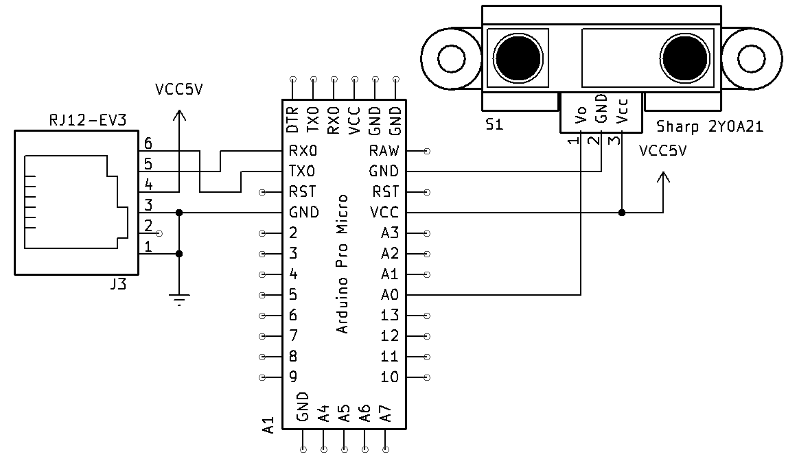
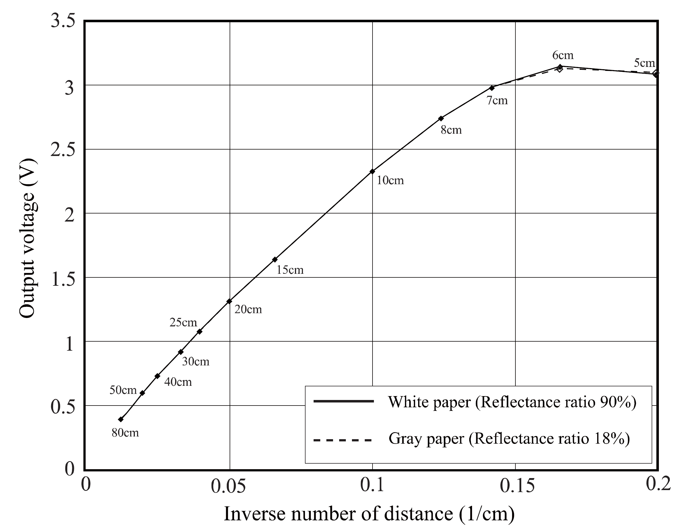

# Sensor de distancia 2Y0A21

Recordemos que el sensor de distancia de Sharp de referencia 2Y0A21 es un sensor laser infrarojo, que tiene un rango útil de medidas entre 10 cm y 80 cm, más detalles de este sensor pueden ser consultados en su [hoja de datos](https://global.sharp/products/device/lineup/data/pdf/datasheet/gp2y0a21yk_e.pdf).

{class="img-center" width="300px"}

## Conexión

A continuación presentamos la conexiones electricas realizadas entre los 3 componentes electricos/electronicos de nuestro sensor persoanlizado.



La conexión `VCC5V` no está completamente definida, pero debe ser conectada con un cable. 

## Calibración

La información de este sensor puede ser recuperada dentro del microcontrolador Arduino usando el comando de lectura analógica.

```analogRead(PIN)```

El resultado que nos entrega este sistema necesita pasar por un proceso de calibración para que la medida sea útil. Ya que en el microcontrolador la información medida es un número entero que va de `0` a `1023` que representa el voltaje de `0V` a `5V`. 

Pero este sensor no es lineal, como podemos ver en su curva de sensibilidad:


Podemos ver que el voltaje cae rápidamente mientras el objeto medido se aleja del sensor. También podemos ver la curva de sensibilidad con el inverso de la distancia que tiene un rango más "lineal" dentro de las distancias del sensor.



Estás dos gráficas las obtuvimos de la hoja de datos del fabricante. Para tomar los datos de la imagen y poder trabajarlos usamos la herramienta [PlotDigitizer](https://plotdigitizer.com/app), descargamos los datos y los abrimos en [excel](2y0a21/calibration-data.xlsx). En este documento usamos la función solver para encontrar los parametros de la ecuación de calibración:

$$
L = \frac{B}{(m+A)^C}
$$

donde $A=16.4566026$, $B=30119.67188$ y $C=1.295989659$. Resultando en esta aproximación de la curva de sensibilidad.


## Programación

Para la programación solo deberemos descargar el código del [repositorio](https://github.com/semillero-ares/custom-sensor-for-EV3) y cargar el código al Arduino Pro Mini. Se podrían usar otros microcontroladores. 


## Referencias

- [Sharp. Hoja de datos del sensor 2Y0A21.](https://global.sharp/products/device/lineup/data/pdf/datasheet/gp2y0a21yk_e.pdf) ([copia](2y0a21/datasheet.pdf))
- [Tutorial Sensor de Distancia SHARP.](https://naylampmechatronics.com/blog/55_tutorial-sensor-de-distancia-sharp.html)
- [Xukyo. _Using a distance sensor GP2Y0A21 with Arduino_.](https://www.aranacorp.com/en/using-a-distance-sensor-gp2y0a21-arduino/)